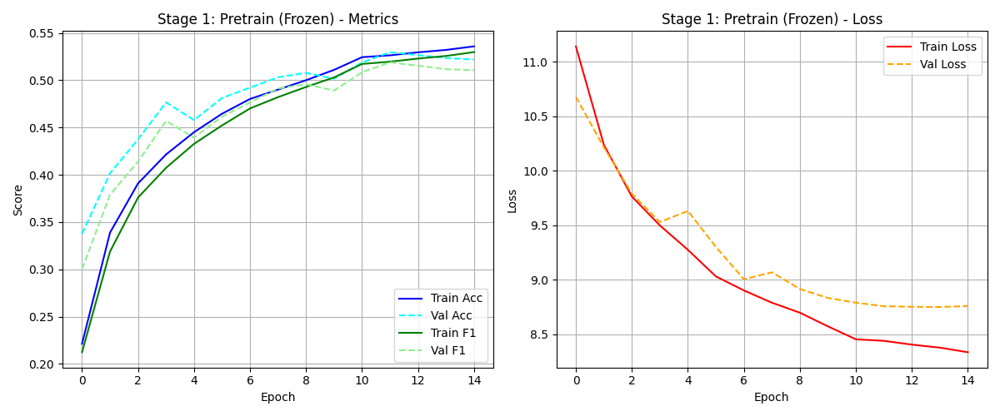
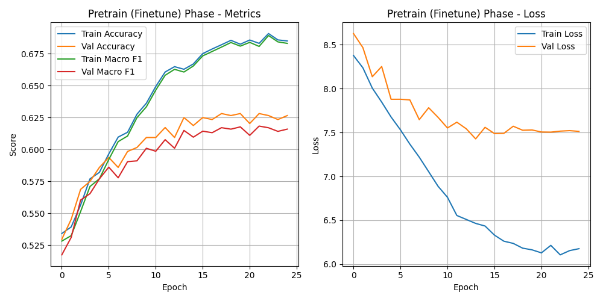
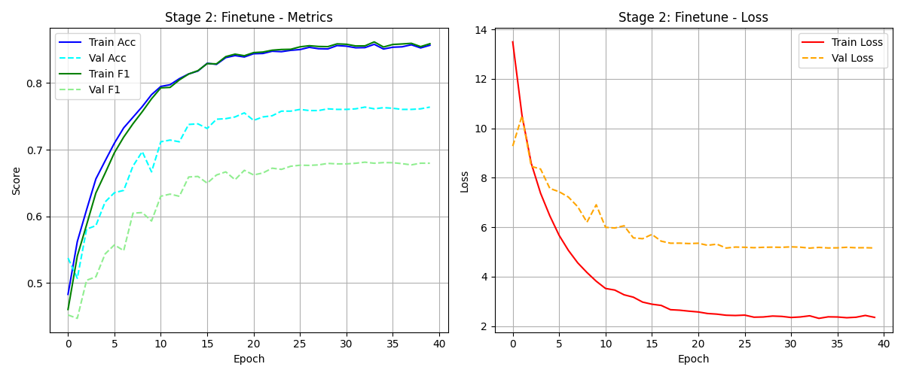
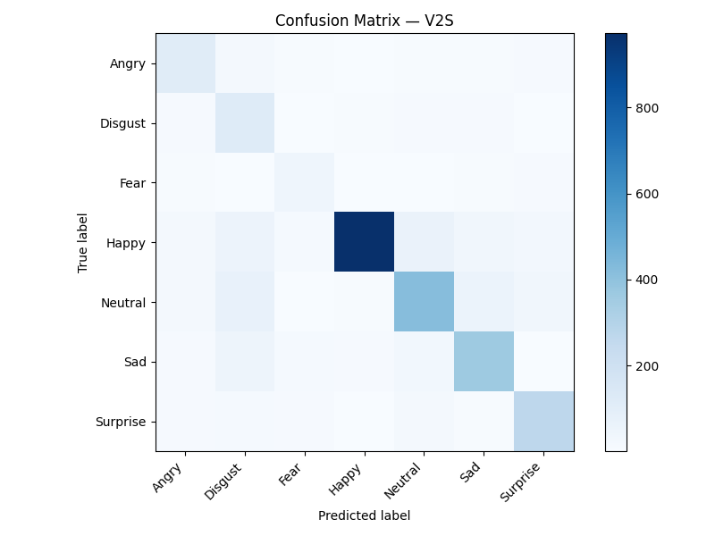

<p align="center">
  
  
  
  
  
  
  
</p>

# 🧠 Emontic AI — Understanding Emotions Beyond Expressions

> **Production-grade facial emotion recognition system powered by EfficientNetV2-S with position-aware multi-head self-attention.**

Emontic AI is a full-stack deep learning application that detects and classifies 7 human emotions from facial images in real time. It combines a custom-trained EfficientNetV2-S backbone with spatial self-attention, served via a FastAPI backend and consumed by a premium React frontend with live webcam support.

---

## ✨ Project Specialties

Emontic AI bridges the gap between deep learning research and ultra-low latency deployment.

- **The Neural Network**: A customized **EfficientNetV2-S** backbone integrated with **Position-Aware Multi-Head Self-Attention**. This allows the network to natively focus on critical micro-expressions independently of global facial rotation. The ONNX export dynamically injects a Softmax layer to guarantee calibrated probabilities natively, bypassing manual temperature scaling on the backend server.
- **The Backend**: **100% TensorFlow-Free** at runtime. By migrating the inference engine to `onnxruntime-gpu`, the backend achieves sub-30ms inference times. The **Multi-Stage OpenCV Haar Cascade** pipeline dynamically cascades across states (`Frontal → Right Profile → Flipped Left Profile`) to track faces from virtually any angle instantly. A secondary RetinaFace-based detector is available for high-precision upload analysis with native eye-landmark alignment.
- **The Frontend**: Features immersive glassmorphism UI with fluid `framer-motion` micro-animations, built on **React 18 + Vite 5 + TailwindCSS 3**. The "Live Emotion" module employs an adaptive, self-regulating webcam capture loop that fires the next request as soon as the previous one completes (with a 150ms minimum gap), streaming uncompressed 1.0 quality JPEGs to preserve micro-expressions for peak accuracy.

---

## ✨ Key Features

| Feature | Description |
|---------|-------------|
| **7-Class Emotion Detection** | Angry, Disgust, Fear, Happy, Neutral, Sad, Surprise |
| **Image Analysis** | Upload a portrait → detect face → classify emotion with confidence scores |
| **Live Webcam Detection** | Real-time emotion recognition via adaptive fire-when-ready capture loop with bounding box overlay |
| **Test-Time Augmentation** | Vectorized TTA (original + flipped + brightened) for both uploads and live webcam |
| **Dual Face Detection** | Multi-Stage Haar Cascades (fast path) + RetinaFace with eye-landmark alignment (precision path) |
| **Prediction History** | SQLite/MySQL-backed history with per-person tracking and record deletion |
| **Confidence Thresholding** | Abstains ("Uncertain") when model confidence is below threshold (0.55 uploads, 0.30 live) |
| **Production Metrics** | Live `/metrics` endpoint tracking request counts, latency, and emotion distribution |

---

## 🏗️ Architecture

```
┌─────────────────────────────────────────────────────────────────┐
│                        Frontend (React + Vite)                  │
│  ┌───────────┐  ┌──────────────┐  ┌─────────┐  ┌─────────────┐  │
│  │ Analyze   │  │ LiveEmotion  │  │ History │  │ PersonHist. │  │
│  │ (Upload)  │  │  (Webcam)    │  │  Page   │  │    Page     │  │
│  └─────┬─────┘  └──────┬───────┘  └────┬────┘  └──────┬──────┘  │
│        │               │               │              │         │
│        └───────────────┼───────────────┼──────────────┘         │
│                        │ Axios HTTP    │                        │
└────────────────────────┼───────────────┼────────────────────────┘
                         │               │
                         ▼               ▼
┌─────────────────────────────────────────────────────────────────┐
│                     Backend (FastAPI + Uvicorn)                 │
│                                                                 │
│  POST /api/predict           ──→  Full TTA inference pipeline   │
│  POST /api/live-predict      ──→  TTA with lower threshold      │
│  GET  /api/history/names     ──→  SQLite/MySQL query            │
│  GET  /api/history/{name}    ──→  Per-person history            │
│  DELETE /api/history/record/{id} → Delete record + cleanup      │
│  GET  /health                ──→  Model status check            │
│  GET  /metrics               ──→  Runtime statistics            │
│                                                                 │
│  ┌───────────────────────────────────────────────────────────┐  │
│  │                    Inference Pipeline                     │  │
│  │                                                           │  │
│  │  Image → Haar Cascade Detection → Eye Alignment → Crop   │  │
│  │  → Resize 224×224 → EfficientNetV2-S + Attention → Result │  │
│  └───────────────────────────────────────────────────────────┘  │
└─────────────────────────────────────────────────────────────────┘
```

### Model Architecture

The neural network is a custom **EfficientNetV2-S** backbone enhanced with a **position-aware multi-head self-attention** mechanism:

```
Input (224×224×3 RGB)
    │
    ▼
EfficientNetV2-S Backbone (ImageNet pretrained, include_preprocessing=True)
    │  Output: (batch, 7, 7, 1280) feature maps
    ▼
Spatial Tokenization — Reshape to (batch, 49, 1280)
    │
    ▼
Learnable Spatial Positional Embedding — (1, 49, 1280) added
    │
    ▼
Multi-Head Self-Attention — 8 heads, key_dim=128
    │
    ▼
Residual Connection + LayerNorm
    │
    ▼
Attention Pooling (4-head Contextual Token Aggregation via learnable queries)
    │
    ▼
BN → Dropout(0.4)
Dense(512, swish) → BN → Dropout(0.3)
Dense(256, swish) → Dropout(0.2)
ArcFace Dense Margin Head → Scaled Logits (Softmax injected at ONNX export)
```

---

## 📁 Project Structure

```
emontic-ai/
├── backend/                    # FastAPI backend server
│   ├── main.py                 # Application entry point with ONNX pre-loading lifecycle hook
│   ├── config.py               # Central configuration (ONNX path, constraints, thresholds, CORS)
│   ├── database.py             # Dual MySQL/SQLite failover with connection pooling & CRUD
│   ├── Dockerfile              # Production container (python:3.11-slim)
│   ├── .env.example            # Environment variable template
│   ├── requirements.txt        # Backend-only dependencies (ONNX Runtime, FastAPI, OpenCV)
│   ├── models/                 # Deployed ONNX model directory
│   │   └── emontic_ai.onnx     # Production ONNX model (~76MB)
│   ├── routers/
│   │   ├── predict.py          # POST /api/predict — TTA-enabled image upload analysis
│   │   ├── live_predict.py     # POST /api/live-predict — TTA with lower confidence threshold
│   │   └── history.py          # GET/DELETE history endpoints for prediction logs
│   └── services/
│       ├── emotion_predictor.py # ONNX inference engine with vectorized TTA & thread-safe metrics
│       ├── face_detector.py    # Dual detector: Haar Cascades (fast) + RetinaFace (precision)
│       └── image_utils.py      # Upload validation (type, size) and EXIF rotation correction
│
├── frontend/                   # React + Vite + TailwindCSS frontend
│   ├── index.html              # HTML entry with Google Fonts (Rajdhani, Orbitron)
│   ├── package.json            # Dependencies: React 18, Framer Motion 11, Axios, Lucide
│   ├── vite.config.js          # Vite 5 + @vitejs/plugin-react
│   ├── tailwind.config.js      # TailwindCSS 3 with custom dark theme tokens
│   ├── postcss.config.js       # PostCSS with TailwindCSS + Autoprefixer
│   ├── eslint.config.js        # ESLint configuration
│   ├── .env                    # VITE_API_URL (defaults to localhost:8000/api)
│   ├── public/
│   │   └── Emontic AI.png      # Application favicon/logo
│   └── src/
│       ├── main.jsx            # React DOM entry (BrowserRouter + StrictMode)
│       ├── App.jsx             # Root layout: aurora background, particles, routing, footer
│       ├── pages/
│       │   ├── AnalyzePage.jsx      # Image upload with person name input & result display
│       │   ├── LiveEmotionPage.jsx  # Real-time webcam detection with bounding box overlay
│       │   ├── HistoryPage.jsx      # Global prediction history grid with search
│       │   └── PersonHistoryPage.jsx # Per-person records with delete functionality
│       ├── hooks/
│       │   ├── useEmotionDetect.js  # Manages upload → predict → result lifecycle
│       │   └── useLiveEmotion.js    # Adaptive fire-when-ready webcam capture loop
│       ├── components/
│       │   ├── Navbar.jsx           # Glassmorphism nav with mobile hamburger menu
│       │   ├── UploadZone.jsx       # Drag-and-drop file uploader (react-dropzone)
│       │   ├── ResultCard.jsx       # Emotion probabilities visualization card
│       │   ├── FaceOverlay.jsx      # Canvas-based face bounding box renderer
│       │   ├── EmotionBadge.jsx     # Animated emotion label with emoji and neon glow
│       │   └── ConfidenceBar.jsx    # Animated confidence progress bar
│       ├── styles/
│       │   └── globals.css          # TailwindCSS directives, CSS variables, and custom components
│       └── utils/
│           └── api.js               # Centralized Axios instance (30s timeout)
│
├── training/                   # Model training pipeline
│   ├── train.py                # 2-stage training orchestrator (CLI) with mixed_float16 policy
│   ├── core/
│   │   ├── config.py           # Hyperparameters, paths, label mappings (AffectNet + RAF-DB)
│   │   ├── model.py            # EfficientNetV2-S + self-attention + ArcFace architecture
│   │   └── losses.py           # ArcFaceLoss, SparseFocalLoss, MacroF1, WarmupCosineDecay
│   ├── training/
│   │   ├── stages.py           # Pretrain (AffectNet) + Finetune (RAF-DB) stage implementations
│   │   └── schedule.py         # LR scheduling & inverse class weight computation
│   ├── data/
│   │   ├── pipeline.py         # tf.data dataset builders with augmentation
│   │   └── augment.py          # Training-time data augmentation transforms
│   ├── eval/
│   │   ├── evaluate.py         # Evaluation metrics & confusion matrix generation
│   │   ├── calibrate.py        # Temperature scaling calibration
│   │   └── bias_audit.py       # Per-class accuracy bias audit
│   └── serve/
│       ├── export.py           # Keras → SavedModel → ONNX export with Softmax injection
│       └── predictor.py        # Standalone inference predictor class
│
├── saved_model/                # Trained model artifacts
│   ├── emontic_ai_v2s/         # TF SavedModel (v2s architecture)
│   ├── MODEL_CARD.md           # Technical model documentation
│   ├── bias_report_v2s.json    # Per-class bias audit metrics
│   ├── calibration_v2s.json    # Temperature scaling parameters
│   └── eval_report_v2s.json    # Full validation evaluation report
│
├── assets/                     # Embedded documentation assets
│   └── metrics/                # Training graphs and confusion matrix PNGs
│
├── datasets/                   # Training datasets (not tracked in git)
│   ├── affectnet/              # AffectNet dataset
│   └── raf-db/                 # RAF-DB dataset
│
├── requirements.txt            # Full project dependencies (training + backend)
└── .gitignore                  # Git exclusion rules
```

---

## 🚀 Quick Start

### Prerequisites

- **Python** 3.11 or higher
- **Node.js** 18+ and npm
- **GPU** (optional but recommended for faster inference)

### 1. Clone the Repository

```bash
git clone https://github.com/MuhammadJasir-M/Emontic-AI-Understanding-Emotions-Beyond-Expressions.git
cd Emontic-AI-Understanding-Emotions-Beyond-Expressions
```

### 2. Backend Setup

```bash
# Create and activate virtual environment
python -m venv .venv

# Windows
.venv\Scripts\activate

# Linux / macOS
source .venv/bin/activate

# Install dependencies
pip install -r backend/requirements.txt

# Configure environment
cp backend/.env.example backend/.env
# Edit backend/.env with your database credentials (SQLite fallback works out of the box)

# Start the backend server
cd backend
uvicorn main:app --reload --host 0.0.0.0 --port 8000
```

The server will start at `http://localhost:8000`. On first request, the model is loaded into memory (~2-5 seconds).

### 3. Frontend Setup

```bash
# In a new terminal
cd frontend

# Install dependencies
npm install

# Start the development server
npm run dev
```

The frontend will be available at `http://localhost:5173`.

---

## 🔧 Configuration

### Backend Environment Variables

| Variable | Default | Description |
|----------|---------|-------------|
| `MODEL_PATH` | `models/emontic_ai.onnx` | Path to the ONNX model file |
| `CONFIDENCE_THRESHOLD` | `0.55` | Minimum confidence to return a prediction (below = "Uncertain") |
| `TTA_ENABLED` | `true` | Enable Test-Time Augmentation for inference |
| `DB_HOST` | `localhost` | MySQL host (falls back to SQLite if unavailable) |
| `DB_USER` | `root` | MySQL username |
| `DB_PASSWORD` | _(empty)_ | MySQL password |
| `DB_NAME` | `emontic_ai_db` | MySQL database name |
| `UPLOAD_DIR` | `uploads` | Directory for storing uploaded images |
| `MAX_FILE_SIZE_MB` | `5` | Maximum upload file size in megabytes |
| `MIN_FACE_BOX_PX` | `30` | Minimum face bounding box side in pixels |
| `CORS_ORIGINS` | `http://localhost:5173,http://localhost:3000` | Comma-separated list of allowed origins |

### Frontend Environment Variables

| Variable | Default | Description |
|----------|---------|-------------|
| `VITE_API_URL` | `http://localhost:8000/api` | Backend API base URL |

---

## 📡 API Reference

### `POST /api/predict`
Upload an image for full emotion analysis with TTA.

**Request**: `multipart/form-data`
| Field | Type | Description |
|-------|------|-------------|
| `file` | File | JPEG, PNG, or WebP image (max 5MB) |
| `person_name` | string | Name identifier for history tracking |

**Response**:
```json
{
  "emotion": "Happy",
  "confidence": 0.9234,
  "all_probs": {
    "Angry": 0.0012, "Disgust": 0.0003, "Fear": 0.0021,
    "Happy": 0.9234, "Neutral": 0.0456, "Sad": 0.0187, "Surprise": 0.0087
  },
  "bbox": { "x": 120, "y": 85, "w": 200, "h": 240 },
  "image_size": { "width": 640, "height": 480 },
  "latency_ms": 245.3,
  "person_name": "Alice"
}
```

### `POST /api/live-predict`
Analyze a base64-encoded webcam frame with TTA enabled and a lower confidence threshold (0.30).

**Request**: `application/json`
```json
{
  "image": "data:image/jpeg;base64,/9j/4AAQ..."
}
```

**Response**:
```json
{
  "emotion": "Happy",
  "confidence": 0.8521,
  "all_probs": { "Angry": 0.02, "Disgust": 0.01, "Fear": 0.01, "Happy": 0.85, "Neutral": 0.06, "Sad": 0.03, "Surprise": 0.02 },
  "bbox": { "x": 150, "y": 90, "w": 180, "h": 220 },
  "image_size": { "width": 640, "height": 640 },
  "latency_ms": 85.2
}
```

> When no face is detected, returns `"emotion": null` with a `"message"` field instead of raising an error.

### `GET /api/history/names`
Returns all unique person names in the prediction history.

### `GET /api/history/{name}`
Returns all predictions for a specific person, ordered by most recent.

### `DELETE /api/history/record/{record_id}`
Deletes a single prediction record and its associated uploaded image file.

### `GET /health`
Returns server and model status.

### `GET /metrics`
Returns runtime inference statistics (request counts, latency percentages, emotion distribution).

---

## 🏋️ Training

The training pipeline uses a **2-stage transfer learning** approach with **mixed_float16** precision for Ada Lovelace Tensor Core acceleration:

### Stage 1 — Pretrain on AffectNet
- ~280,000 images from AffectNet (internet-sourced faces)
- Frozen backbone → unfreezes block6 layers (top 60) for fine-tuning
- **ArcFace Loss** (margin=0.3, scale=30.0) with label smoothing (0.1) to protect against noise
- Inverse class-weighting baked natively into the `tf.data` pipeline to combat extreme data skew
- Warmup cosine decay learning rate schedule with 500-step recovery checkpointing

### Stage 2 — Finetune on RAF-DB
- ~12,271 crowdsourced images from RAF-DB
- Unfreezes block5 + block6 backbone layers (top 120)
- Strict **ArcFace Loss** (margin=0.3, scale=30.0) with label smoothing dropped to 0.0 for sharp decision boundaries
- Inverse class-weighting applied for target domain distribution
- Lower learning rate (2e-5) for precise domain adaptation

### Running Training

```bash
# Full 2-stage training
python training/train.py --arch v2s --stage all

# Only pretrain
python training/train.py --arch v2s --stage pretrain

# Only finetune (requires a pretrained checkpoint)
python training/train.py --arch v2s --stage finetune --checkpoint path/to/checkpoint.keras
```

### Training Configuration

Key hyperparameters are centralized in [`training/core/config.py`](training/core/config.py):

| Parameter | Value | Description |
|-----------|-------|-------------|
| Input Size | 224×224 | High-density spatial dimensions |
| Batch Size | 64 | Training batch size for V2S |
| Pretrain LR | 1e-4 → 2.5e-5 | Frozen → unfrozen learning rates |
| Finetune LR | 2e-5 | Locked rate for target domain alignment |
| Loss | ArcFaceLoss | margin=0.3, scale=30.0 |
| Optimizer | AdamW | weight_decay=0.01, clipnorm=1.0 |
| Warmup Ratio | 0.05 | Linear warmup fraction of total steps |
| Head Dropout | 0.4 / 0.3 / 0.2 | 3-stage progressive dropout in classification head |
| Dense Units | 512 → 256 | Two-layer classification head with swish activation |

### 📈 Training Metrics & Results

The finalized ONNX model achieved robust performance across the 7 emotion classes. The training trajectories and final confusion matrix are available below:

<p align="center">
  
  
  <br/>
  
  
</p>

### Export for Deployment

```bash
# Export checkpoint to SavedModel + ONNX with Softmax injection
python training/serve/export.py --checkpoint path/to/best.keras --arch v2s --out-dir backend/models/emontic_ai
```

This will:
1. Load the `.keras` checkpoint with all custom layers (ArcFaceDense, AttentionPooling, etc.)
2. Append a Softmax layer to convert ArcFace logits to calibrated probabilities
3. Export as TF SavedModel to `backend/models/emontic_ai/`
4. Convert to ONNX via `tf2onnx` at `backend/models/emontic_ai.onnx`

---

## 🗄️ Database

Emontic AI uses a **dual-database strategy**:

1. **MySQL** (primary) — Used when MySQL is available and configured via `.env`. Uses a connection pool (`pool_size=5`) with `utf8mb4` charset.
2. **SQLite** (fallback) — Automatically used when MySQL is unavailable (`emontic_ai.db` created in the backend directory).

No manual database setup is required for development — SQLite works out of the box.

### Schema

```sql
CREATE TABLE emotion_history (
    id          INTEGER PRIMARY KEY AUTOINCREMENT,  -- INT AUTO_INCREMENT for MySQL
    person_name TEXT NOT NULL,                       -- VARCHAR(100) for MySQL
    image_path  TEXT,                                -- VARCHAR(255) for MySQL
    predicted_emotion TEXT NOT NULL,                 -- VARCHAR(50) for MySQL
    confidence  REAL,                                -- FLOAT for MySQL
    created_at  TIMESTAMP DEFAULT CURRENT_TIMESTAMP
);

-- Index on person_name for fast lookups
CREATE INDEX idx_person_name ON emotion_history(person_name);
```

### CRUD Operations

| Operation | Function | Description |
|-----------|----------|-------------|
| **Create** | `save_prediction()` | Inserts a new prediction record with person name, image path, emotion, and confidence |
| **Read** | `get_unique_names()` | Returns all distinct person names for the history page |
| **Read** | `get_history_by_name()` | Returns all predictions for a specific person, sorted by most recent |
| **Delete** | `delete_prediction()` | Deletes a record by ID and returns the image path for file cleanup |

---

## 🐳 Docker

```bash
cd backend
docker build -t emontic-ai-backend .
docker run -p 8000:8000 emontic-ai-backend
```

---

## 🛡️ Inference Pipeline Detail

```
Upload/Webcam Frame
       │
       ▼
 Validate (type, size, EXIF orientation correction)
       │
       ▼
 Face Detection (two paths):
   ├── Fast path (Haar Cascades): Frontal (alt2) → Right Profile → Flipped Left Profile
   │   └── Eye-based alignment via Haar eye cascade
   └── Precision path (RetinaFace): Full landmark detection with native eye alignment
       │
       ▼
 Crop face with padding → Resize to 224×224 (bicubic)
       │
       ▼
 Preprocessing: float32 [0, 255] (model handles internal normalization)
       │
       ├── Upload path: TTA (original + flipped + brightened) → batch predict → average
       │   └── Confidence threshold: 0.55
       │
       └── Live path: TTA (same batch) with lower confidence threshold: 0.30
       │
       ▼
 Confidence threshold check → "Uncertain" if below threshold
       │
       ▼
 Return: emotion, confidence, all_probs, bbox, image_size, latency_ms
```

---

## 🧪 Health Check

```bash
# Verify the backend is running and model is loaded
curl http://localhost:8000/health

# Expected response:
# {"status": "ok", "model": "loaded"}
```

---

## 📊 Emotion Classes

| Index | Emotion | Color |
|-------|---------|-------|
| 0 | Angry | 🔴 Red |
| 1 | Disgust | 🟣 Purple |
| 2 | Fear | 🟠 Orange |
| 3 | Happy | 🟡 Yellow |
| 4 | Neutral | 🟢 Green |
| 5 | Sad | 🔵 Blue |
| 6 | Surprise | 🩵 Teal |

---

## 🛠️ Tech Stack

| Layer | Technology |
|-------|-----------|
| **Deep Learning** | TensorFlow 2.21, Keras 3.14, EfficientNetV2-S |
| **Loss Function** | ArcFace Additive Angular Margin Loss |
| **Face Detection** | OpenCV Haar Cascades (fast), RetinaFace (precision) |
| **Inference** | ONNX Runtime (GPU/CPU), Vectorized TTA |
| **Backend** | FastAPI, Uvicorn, Python 3.11+ |
| **Frontend** | React 18, Vite 5, TailwindCSS 3, Framer Motion 11 |
| **UI Library** | Lucide React (icons), React Hot Toast, React Dropzone |
| **Database** | MySQL (primary) / SQLite (auto-fallback) |
| **Image Processing** | OpenCV, Pillow |
| **Deployment** | Docker, ONNX Runtime GPU |

---

## 📄 License

This project is for educational and research purposes. The trained model weights are project-internal and not for redistribution. See the [Model Card](saved_model/MODEL_CARD.md) for detailed model documentation.

---

<p align="center">
  <strong>Built with ❤️ by Muhammad Jasir M AKA MDJR</strong><br/>
  <em>Emontic AI - Understanding Emotions Beyond Expressions</em>
</p>
